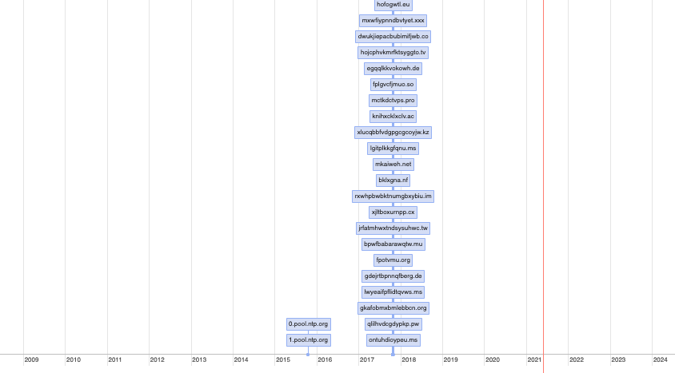

Data source sample is in sample_dgas_firstseen.txt

Run with ```python3 make_timeline.py```

if you run with the sample, sample_dgas_firstseen_timeline.html will be created. Open that to see what the timeline looks like.

When looking at the html doc, depending on the data, you might have to zoom out (using the default browser zoom controls) to really see everything. You can also use the mouse wheel to zoom in and out within the graph itself.


Here's a pic:

