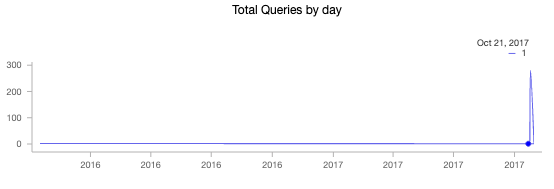

Data source sample is in sample_dgas_firstseen.txt. If your time format is different, adjust line 22  of make_metricgraphics.py to fit. See lines 19 and 20 for examples.

Run with ```python3 make_metricgraphics.py```

if you run with the sample, static/data/query_count.json will be created. 

To view it, run:

```python3 app.py```

Open a browser and go to: ```127.0.0.1:5000```

Here's a pic:

